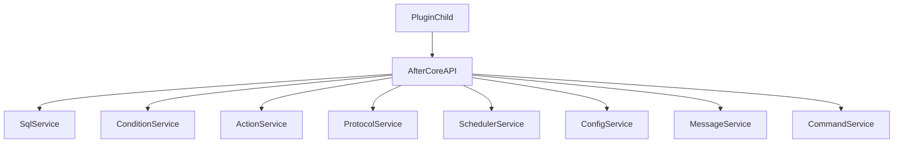

## AfterCore — Implementation Plan (executável por outra LLM)

### Contexto e objetivo
O **AfterCore** é um plugin “library/dependency” que centraliza infraestrutura comum do ecossistema AfterLands (Paper/Spigot 1.8.8, rodando em Java 21). Ele **não** entrega gameplay; ele entrega **APIs** e **serviços** reutilizáveis, focando em **performance**, **baixa duplicação** e **main thread sacred**.

### Princípios mandatórios
- **ZERO I/O na main thread** (DB, filesystem, rede, etc. sempre async).
- **PlaceholderAPI somente na main thread**.
- **Graceful degradation**: se ProtocolLib/PlaceholderAPI não existir, degradar funcionalidade sem crash.
- **Cache bounded** (max size + TTL) e com métricas (quando útil).
- **Sem reflection em hot-path** (reflection no startup/registration, ok).

---

## 0) Pré-requisitos (antes de migrar plugins e antes do "dev real")

**STATUS: ✅ COMPLETO (v0.1.0)**

Essas entregas devem existir **antes** de começar migração de plugins e antes de implementar o pipeline MAP_CHUNK completo. Elas reduzem retrabalho e tornam o core depurável desde o dia 1.

### 0.1) Config updater + validação de schema ✅
**Motivo**: a maior parte dos bugs iniciais vem de config inválida/antiga.

**Entregas**
- ✅ `config-version` no `config.yml`
- ✅ Updater que:
  - mescla defaults novos
  - preserva valores do usuário
  - aplica migrations de chaves (quando necessário)
- ✅ Validator que:
  - retorna lista de erros/avisos com caminhos (`database.pool.maximum-pool-size`, etc.)
  - permite "fail-fast" em parâmetros críticos

**Pacotes implementados**
- `com.afterlands.core.config.update` - ConfigUpdater
- `com.afterlands.core.config.validate` - ConfigValidator, ValidationError, ValidationResult

### 0.2) Diagnostics/Health + comando padrão do core ✅
**Motivo**: sem diagnóstico, debugging vira "no escuro".

**Entregas**
- ✅ Comando `/acore` com subcomandos:
  - ✅ `status` (dependências detectadas, versões, flags)
  - ✅ `db` (enabled/initialized, ping/latência, pool stats)
  - ✅ `threads` (tamanho de pools)
  - ✅ `system` (JVM, OS, memória, CPU cores)
  - ✅ `metrics` (snapshot do MetricsService)
  - ✅ `all` (todas as informações)

**Pacotes implementados**
- `com.afterlands.core.diagnostics` - DiagnosticsService, DiagnosticsSnapshot
- `com.afterlands.core.diagnostics.impl` - DefaultDiagnosticsService
- `com.afterlands.core.diagnostics.commands` - ACoreCommand

### 0.3) CoreResult + códigos de erro padronizados ✅
**Motivo**: APIs do core precisam falhar de forma previsível (sem stacktrace spam e sem exceções em hot-path).

**Entregas**
- ✅ `CoreResult<T>` com `ok(value)` / `err(code, message, cause?)`
- ✅ `CoreErrorCode` enum completo:
  - `DEPENDENCY_MISSING`, `DB_DISABLED`, `DB_UNAVAILABLE`, `TIMEOUT`, `INVALID_CONFIG`, `NOT_ON_MAIN_THREAD`
  - `ON_MAIN_THREAD`, `NOT_FOUND`, `FORBIDDEN`, `INVALID_ARGUMENT`, `INTERNAL_ERROR`, `UNKNOWN`
- ✅ Pattern matching support (Java 21 sealed interfaces)
- ✅ API funcional: `map()`, `flatMap()`, `recover()`, `ifOk()`, `ifErr()`, `orElse()`, `orNull()`, `toOptional()`

**Pacotes implementados**
- `com.afterlands.core.result` - CoreResult (sealed interface), CoreResult.Ok, CoreResult.Err, CoreErrorCode, ErrorInfo

### 0.4) Retry/backoff + rate-limit utils ✅
**Motivo**: DB/rede falham; políticas consistentes evitam spikes e bugs.

**Entregas**
- ✅ `RetryPolicy` (max retries, max elapsed, jitter, exceções retryable)
- ✅ `Backoff` (exponencial/linear/fixo com jitter)
- ✅ `RetryExecutor` (sync e async com CompletableFuture)
- ✅ `RateLimiter` interface + `TokenBucketRateLimiter` (thread-safe)
- ✅ `CooldownService` (per-player/per-key com formatação de duração)

**Pacotes implementados**
- `com.afterlands.core.util.retry` - RetryPolicy, Backoff, RetryExecutor
- `com.afterlands.core.util.ratelimit` - RateLimiter, TokenBucketRateLimiter, CooldownService

### 0.5) MetricsService (leve) ✅
**Motivo**: sem métricas, não dá para validar orçamento de TPS nem detectar regressões.

**Entregas**
- ✅ Counters e timers (nanoTime) com snapshot
- ✅ Gauges para valores instantâneos
- ✅ Integração com `/acore metrics`
- ✅ Thread-safe (ConcurrentHashMap + atomics)
- ✅ Overhead mínimo (LongAdder, AtomicLong)
- ✅ Helper `time()` para medir operações

**Pacotes implementados**
- `com.afterlands.core.metrics` - MetricsService, MetricType
- `com.afterlands.core.metrics.impl` - DefaultMetricsService, MetricsSnapshot

### Estado atual no repositório (já implementado)
O esqueleto inicial já existe em:
- `AfterCore/pom.xml`
- `AfterCore/src/main/resources/plugin.yml`, `config.yml`, `messages.yml`
- API e bootstrap:
  - `AfterCore/src/main/java/com/afterlands/core/api/AfterCoreAPI.java`
  - `AfterCore/src/main/java/com/afterlands/core/api/AfterCore.java`
  - `AfterCore/src/main/java/com/afterlands/core/bootstrap/AfterCorePlugin.java`
- Serviços iniciais:
  - Scheduler: `com.afterlands.core.concurrent.*`
  - Config/Messages: `com.afterlands.core.config.*`
  - SQL: `com.afterlands.core.database.*`
  - Conditions: `com.afterlands.core.conditions.*`
  - Actions: `com.afterlands.core.actions.*`
  - Protocol (stub): `com.afterlands.core.protocol.*`
  - Spatial: `com.afterlands.core.spatial.*`
  - Commands (stub): `com.afterlands.core.commands.*`

> Nota: libs internas (Hikari/Caffeine/MySQL) são **shaded + relocadas**. A API pública não deve expor esses tipos.

---

## Arquitetura (alto nível)



---

## 1) Service Discovery / DI leve (Bukkit ServicesManager)

### Padrão recomendado
- O AfterCore registra `AfterCoreAPI` no `ServicesManager` no `onEnable()`.
- Plugins consumidores obtêm via helper:
  - `com.afterlands.core.api.AfterCore.get()`

### Regras
- Consumers **não** devem manter referência estática forte se existe possibilidade de reload.
- O helper já tem cache interno e `invalidate()` é chamado no enable/disable do core.

### Exemplo (consumer)
```java
AfterCoreAPI core = AfterCore.get();
core.sql().runAsync(conn -> { /* query */ });
```

---

## 2) Concurrency & Scheduler

### Contrato
`SchedulerService` deve oferecer:
- `ioExecutor()` para tarefas bloqueantes (DB, filesystem).
- `cpuExecutor()` para tarefas CPU-bound.
- `runSync()` / `runLaterSync()` para garantir execução na main thread.

### Checklist de implementação
- [x] Pools nomeados, daemon threads.
- [ ] Instrumentar fila/latência e expor métricas via `MetricsService` + `/acore threads`.

---

## 3) Database Manager (SqlService)

### Objetivo
Fornecer pool + helpers async + migrations/DDL por plugin, sem duplicação.

### Referência externa
Seguir o README oficial do HikariCP: [HikariCP](https://github.com/brettwooldridge/HikariCP).

### Tipos de database suportados (MVP)
- **MySQL** (produção): `database.type: mysql`
- **SQLite** (dev/local): `database.type: sqlite`

> Nota: SQLite é single-writer e tende a ter lock contention se você usar pool grande. Default recomendado: pool pequeno (1).

### Estratégia para múltiplos plugins (mesmo host) — databases + prefixo
Você quer diferenciar **databases/schemas** (e usar **prefixo** quando necessário). A estratégia recomendada é:

- **Opção A (recomendada para plugins grandes)**: **datasource por plugin** apontando para **database/schema próprio**, ainda no mesmo host:
  - Ex.: `primary` → `afterlands`, `abs` → `afterlands_abs`, `motion` → `afterlands_motion`
  - Prós: isolamento, manutenção simples, menos risco de colisão.
  - Contras: mais de um pool (mitigar com pool sizes pequenos e limite de datasources).
- **Opção B (recomendada quando você quer 1 pool só)**: **uma database + prefixo por plugin** usando o datasource `primary`:
  - Ex.: `abs_player_flags`, `motion_scenes`, `aba_placements`
  - Prós: um pool só.
  - Contras: migrations/índices competem no mesmo schema e colisões ficam mais prováveis.

> Regra prática: comece com **Opção B** para plugins pequenos e migre para **Opção A** quando o plugin crescer ou precisar de isolamento.

### Preparação para múltiplos hosts (analytics etc.) — datasources nomeados
Mesmo que inicialmente todos usem o mesmo host, é melhor especificar desde já o modelo de evolução:

- Introduzir um **Database Registry** no AfterCore:
  - Mantém `AfterCoreAPI.sql()` como datasource **primary** (compat).
  - Adiciona um serviço novo (ex.: `SqlRegistry`) para obter outros datasources por nome:
    - `SqlService sql(String name)` → ex.: `"primary"`, `"analytics"`, `"local_cache"`
  - Cada datasource tem seu próprio `type`, credenciais e pool.

**Por que isso é melhor do que “trocar catalog/schema na mesma conexão”?**
- Trocar `catalog` em conexão pooled exige reset perfeito (fácil de vazar estado).
- Múltiplos schemas/hosts viram problemas de observabilidade/health se não forem “first-class” no core.

### Config — forma atual (single datasource) e forma futura (multi datasource)
**Forma atual (já implementada):**
- `database.type: mysql|sqlite`
- `database.mysql.*` ou `database.sqlite.*`

**Forma futura (quando `SqlRegistry` existir):**
```yaml
database:
  datasources:
    primary:
      enabled: true
      type: mysql
      mysql: { host: localhost, port: 3306, database: afterlands, username: root, password: "" }
      pool: { maximum-pool-size: 10, minimum-idle: 2 }
    abs:
      enabled: true
      type: mysql
      mysql: { host: localhost, port: 3306, database: afterlands_abs, username: root, password: "" }
      pool: { maximum-pool-size: 6, minimum-idle: 2 }
    analytics:
      enabled: true
      type: mysql
      mysql: { host: analytics-db.local, port: 3306, database: afterlands_analytics, username: analytics, password: "" }
      pool: { maximum-pool-size: 4, minimum-idle: 1 }
    local_cache:
      enabled: true
      type: sqlite
      sqlite: { file: aftercore-cache.db, connection-init-sql: "PRAGMA foreign_keys=ON;" }
      pool: { maximum-pool-size: 1, minimum-idle: 1 }
```

### Contrato público (já existe)
`com.afterlands.core.database.SqlService`:
- `reloadFromConfig(ConfigurationSection database)`
- `DataSource dataSource()`
- `Connection getConnection()` (uso em contextos já async)
- `supplyAsync(...)` / `runAsync(...)` (executa no `ioExecutor`)
- `registerMigration(id, migration)`

### Config keys (já existe em `config.yml`)
`database.*` e `database.pool.*`:
- `enabled`, `type`
- `mysql.host`, `mysql.port`, `mysql.database`, `mysql.username`, `mysql.password`
- `sqlite.file`, `sqlite.connection-init-sql`
- `maximum-pool-size`, `minimum-idle`, `connection-timeout`, `idle-timeout`, `max-lifetime`

### Padrão de migrations
Cada plugin deve registrar migrations no startup (antes de usar repos):
- Ex.: `abs_player_flags` do AfterBlockState vira uma migration registrada no core.

**Quando existir `SqlRegistry`:**
- Migrations precisam ser por datasource:
  - `registerMigration(dataSourceName, migrationId, migration)`
- E devem ficar “namespaced” por plugin:
  - Ex.: `abs:001_create_flags_table`

**Regras para migrations**
- Devem ser **idempotentes**: `CREATE TABLE IF NOT EXISTS`, `ALTER TABLE ... ADD COLUMN IF NOT EXISTS` (quando possível), etc.
- Nunca rodar na main thread.
- Devem falhar rápido e logar claramente; se migration falhar, o plugin consumidor deve **degradar** (feature off) ou falhar o enable (decisão do plugin).

### Shutdown seguro (classloader)
Há um workaround implementado para pré-carregar classes do driver relocado (evita `ClassNotFoundException` durante `close()` em alguns cenários de unload). Manter e evoluir conforme necessário.

### Pendências recomendadas (próximas iterações)
- [ ] `inTransaction(...)` helper.
- [ ] `isAvailable()` check.
- [ ] Circuit breaker simples: se DB cair, backoff + feature degradation.
- [ ] Retry/backoff padronizado (com jitter) para falhas transitórias (DB restart / network partition).

---

## 4) Condition Engine (ConditionService)

### Objetivo
Um motor único para substituir:
- `AfterBlockState` (`ConditionEngine`)
- `AfterMotion` (`ConditionEvaluator`)

### Sintaxe suportada (MVP)
- `AND`, `OR`, `NOT`
- Parênteses `( ... )`
- Grupos de condição (nome → lista de expressões, implicitamente AND)
- Comparações numéricas:
  - `==`, `!=`, `>`, `<`, `>=`, `<=`
- Operadores string (superset do AfterMotion):
  - `equals`, `!equals`, `equalsIgnoreCase`, `!equalsIgnoreCase`
  - `contains`, `!contains`, `startsWith`, `!startsWith`, `endsWith`, `!endsWith`
  - `matches`, `!matches`
  - `~` (legacy contains)

### Placeholder pipeline (ordem)
1. **Custom providers** do core (namespace): ex.: `%abs_flag:key%`
2. **PlaceholderAPI** (se presente) — **main thread only**
3. Fallback placeholders básicos (player/world/etc.) quando PAPI não existir

### Extensibilidade por plugin
Plugins registram providers:
- `registerVariableProvider("meu_namespace", provider)`
- Ex.: `AfterBlockAnimations` poderia registrar `%aba:is_playing%` e afins.

### Caching
MVP atual cacheia expansão (groups + custom placeholders).
Próximo passo recomendado:
- [ ] Cache do parse/AST por expressão (`expression -> AST`)
- [ ] Cache de resultados por `(playerId, expression, ctxVersion)` onde fizer sentido

---

## 5) Action Engine (ActionService) — dialetos

### Objetivo
Suportar o caso comum (“simple line”) e manter compatibilidade com AfterMotion.

### Modelo comum
`ActionSpec` é o contrato de saída para todos dialetos:
- `typeKey`, `rawArgs`
- `timeTicks` / `frameIndex` (dialeto ABA)
- `trigger` / `condition` / `scope` / `scopeRadius` (dialeto AfterMotion)

### Dialetos
1) **SimpleKV (default)** — estilo AfterBlockAnimations
- `"<action>: <args>"`
- `"time: 20, play_sound: ..."`
- `"frame: 5, teleport: ..."`

2) **MotionDSL (opcional)** — estilo AfterMotion
- `"@tick:20 [?cond] title[NEARBY:30]: ..."`

### Estratégia determinística
- Se começa com `@` → MotionDSL
- Caso contrário → SimpleKV

### Registry (sem switch/case)
MVP atual possui `registerHandler(typeKey, handler)`.
Próximo passo recomendado:
- [ ] Separar `ActionTypeRegistry` e padronizar factories/parsers por tipo.
- [ ] Adicionar executor padrão com scopes (VIEWER/NEARBY/ALL) e integração com `ConditionService`.

---

## 6) Packet & Protocol Utils (ProtocolService + ChunkPipeline)

### Objetivo
Evitar conflitos quando múltiplos plugins precisam modificar chunks/blocos via ProtocolLib.

### Contrato (MVP)
`ChunkMutationProvider`:
- `id()`
- `priority()` (maior aplicado por último; último ganha)
- `mutationsForChunk(player, world, chunkX, chunkZ)`

### MVP atual
`DefaultProtocolService` é um stub com graceful degradation (não registra listener ainda).

### Implementação completa (spec operacional)
#### Listener único
- Registrar **um** `PacketAdapter` no core para:
  - `PacketType.Play.Server.MAP_CHUNK`
  - `PacketType.Play.Server.MAP_CHUNK_BULK` (1.8.8)
- O listener **não** deve fazer trabalho pesado no callback de pacote.

#### Debounce/batching (main thread)
Meta: evitar spam em login/teleport/chunk burst.
- Use uma estratégia no estilo do `StateApplicationScheduler`:
  - `dirtyChunksByPlayer` (UUID → set de (world,chunkX,chunkZ))
  - Um task por player por janela de tempo (ex.: 50–100ms) que coalesce múltiplos marks.
- Parâmetros recomendados (configuráveis):
  - `batchIntervalMs`: 50–100ms
  - `maxChunksPerBatch`: 8–32
  - `distancePriority`: true

#### Coleta de mutations (hot-path constraints)
Para cada chunk a processar:
- Iterar providers em ordem de `priority` (ascendente).
- Cada provider retorna `List<BlockMutation>` **já filtrada** para o chunk solicitado.
- Providers devem ser “fast”: se depender de DB, devem retornar somente o que estiver em cache e agendar refresh async.

#### Merge determinístico (conflito)
Regra: “último ganha” (maior priority sobrescreve).
- Algoritmo:
  1. `Map<BlockPosKey, BlockMutation> merged = new HashMap<>(expectedSize)`
  2. Para provider em ordem ascendente:
     - para mutation em list: `merged.put(key(x,y,z), mutation)`
  3. `conflictCount += (put sobrescreveu valor anterior)`
- Métricas:
  - `conflicts_total` por provider e total
  - `mutations_total` por provider

#### Aplicação via MULTI_BLOCK_CHANGE
- Agrupar por chunk (no caso do pipeline MAP_CHUNK, normalmente é “um chunk por vez”).
- Construir `PacketType.Play.Server.MULTI_BLOCK_CHANGE` com:
  - `ChunkCoordIntPair(chunkX, chunkZ)`
  - `MultiBlockChangeInfo[]` com `Location(null, x,y,z)` + `WrappedBlockData`
- Enviar com `sendServerPacket(player, packet, false)` para evitar reentrância do próprio interceptor.

#### Thread model (regras)
- Parsing/merge e montagem do `PacketContainer` pode ser feito em thread do core **desde que**:
  - Não use APIs não-thread-safe do Bukkit (Player/World/getBlock, etc.) fora da main thread.
  - A criação/uso de `org.bukkit.Location` pode ser evitada em async (preferir instanciar na main thread se necessário).
- Recomendação prática: manter a etapa final (montar pacote e enviar) na main thread e mover somente computações puras para async.

### Implementação completa (tarefas) — Release 0.2

**Status: ✅ COMPLETO**

- [x] **Listener MAP_CHUNK/MAP_CHUNK_BULK**
  - Arquivo: `DefaultProtocolService.java`
  - Registrar PacketAdapter único
  - Capturar chunk coordinates do pacote
  - Marcar chunk como "dirty" no batcher

- [x] **ChunkDebounceBatcher** (arquivo criado)
  - `dirtyChunks: Map<UUID, Set<ChunkKey>>`
  - Janela configurável (config key: `protocol.batch-interval-ms`, default 50)
  - Max chunks por batch (config key: `protocol.max-chunks-per-batch`, default 16)
  - Priorização por distância ao player
  - Cancelar pending batch no player quit

- [x] **ChunkMutationMerger** (arquivo criado)
  - Iterar providers em ordem de prioridade (ascendente)
  - `Map<BlockPosKey, BlockMutation>` para merge
  - Contador de conflitos por provider
  - Métrica `conflicts_total`

- [x] **Applier MULTI_BLOCK_CHANGE**
  - Construir `PacketContainer` com `ChunkCoordIntPair`
  - Array de `MultiBlockChangeInfo` com posições relativas
  - Enviar com `sendServerPacket(player, packet, false)`

- [x] **Health/Debug via ProtocolStats**
  - `getStats()` retorna snapshot de métricas
  - Métricas: chunksProcessed, mutationsApplied, conflictsTotal, packetsQueued
  - Estatísticas por provider

---

## 7) Config/Messages/Commands

### Config/Messages
Já existe implementação mínima:
- `DefaultConfigService`, `DefaultMessageService`

Próximo passo recomendado:
- [ ] “Config updater” com versionamento/merge de defaults
- [ ] Suporte a múltiplos arquivos (ex.: `states/*.yml`)

### Commands
Existe um stub de `CommandService` + anotações.
Próximo passo recomendado:
- [ ] Implementar registro real via CommandMap (reflection **somente** no startup)
- [ ] Parser de args + help automático
- [ ] Integração com `MessageService` (mensagens padronizadas)

---

## 8) Plano de migração (ordem recomendada)
1. **AfterBlockState → SqlService** (remover DataSourceProvider local; registrar migration `abs_player_flags` no core).
2. **AfterBlockState + AfterMotion → ConditionService** (remover engines duplicados).
3. **AfterBlockAnimations → ActionService (SimpleKV)** (mais comum, menor risco).
4. **AfterMotion → ActionService (MotionDSL)**.
5. **Spatial utils** (ChunkKey/ChunkSpatialIndex).
6. **Protocol pipeline** (AfterBlockState vira um provider do core).
7. **Config/Messages/Commands** (migrar 1 plugin piloto por vez).

---

## Checklist de validação (para cada release)
- [ ] Build `mvn clean package` OK
- [ ] Nenhum `.get()`/blocking de futures na main thread
- [ ] PlaceholderAPI apenas main thread
- [ ] Caches bounded (size+TTL)
- [ ] Logs de erro com contexto suficiente (pluginId, feature, etc.)

